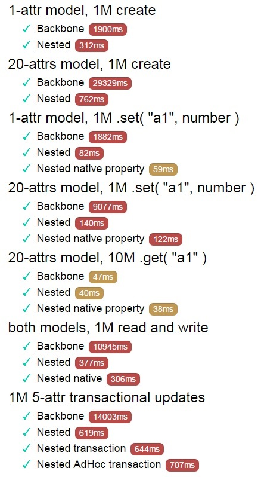

# Getting Started

master: [](https://travis-ci.org/Volicon/backbone.nestedTypes)
develop: [](https://travis-ci.org/Volicon/backbone.nestedTypes)

Version 1.1.2 highlights:

- npm package name is changed to just 'nestedtypes'. Thus, `npm install nestedtypes`.
- It export all the stuff which is required to use it as drop-in backbonejs replacement in your project.
- Models has reference to the parent model through `this._owner`
- When the same model is shared between tho other models, attempt to serialize the model which is not an owner will result in [Serialization Error] warning. In most of the cases, this warning is the sign of weird errors, because after loading data this shared models won't be shared any more.
- Collections has new `changes` event, which can be used directly on collection instead of 'add remove change reset'. It's efficient, and fired only once during compound changes.
- There are Collection.transaction( func ) method which can be used ad-hoc to group sequence of changes coming from inside of func to the single transaction, thus, firing just one 'changes' event. Helpful for reducing an amount of renders.
- Every method declared on Collection can be turned to be transactional when its definition is wrapped in Nested.transaction.
- There are completely new mechancs of Stores, which will be documented later, and will allow us to refactor collections with mutual references which has to be requested together (such as users-roles-channelSets). It will be documented later.

Major change you need to do now:
```javascript
// Instead of...
Nested.store = {
    // attribute spec
}

// ..you need write:
Nested.store = new Nested.LazyStore.defaults({
    // attribute spec
});
```
Why? Because now Stores are first-class objects in the system, they can be created with `new`,  
they supports hierarchical lookups, they may have different transports, and more. The more about it later.

Browse complete documentation here: http://volicon.github.io/backbone.nestedTypes/

## What it is

It's modern data framework, mostly backward compatible with backbone.js and can be used as drop-in backbonejs replacement.

Compared to `backbonejs`, it's has order of magnitude faster model updates, and support all the features which could be found
in state of the art model frameworks through lightweight and declarative attribute type annotations.

### Complex attribute types

* Cross-browser handling of Date attribute type.
* Nested models and collections.
* One-to-many and many-to-many model relationships.

It's achieved using attribute type annotations, which feels in much like statically typed programming language. Yet, this annotations are vanilla JavaScript, no transpiler step is required.

### Safety

NestedTypes check types on every model update and perform dynamic type casts to ensure that attributes will always hold values of proper type.

As result, NestedTypes models are extremely reliable. It's impossible to break client-server protocol with inaccurate attribute assignment. If something will go really wrong, it will fix an error and warn you with a messages in the console.

### Performance
NestedTypes uses attribute type information for sophisticated optimizations targeting modern JS JIT engines.

Compared to backbonejs, model updates are up to 40 times faster in Chrome/nodejs, and at least 4 times faster in other browsers.


### How it looks like
It looks and feels in much like statically typed language.

```javascript
var User = Nested.Model.extend({
    urlRoot : '/api/users',

    defaults : {
        // Primitive types
        login    : "", // String
        email    : String.value( null ), // null, but String
        loginCount : Number.has.toJSON( false ) // 0, not serialized
        active   : Boolean.value( true ), // true

        created  : Date, // new Date()

        settings : Settings, // new Settings()

        // collection of models, received as an array of model ids
        roles    : Role.Collection.subsetOf( 'store.roles' ),
        // reference to model, received as model id.
        office   : Office.from( 'store.offices' )
    }
});

var collection = new User.Collection();
collection.fetch().done( function(){
    var user = collection.first();
    console.log( user.name ); // native properties
    console.log( user.office.name );
    console.log( user.roles.first().name );
});
```
> Types are being checked in run-time on assignment, but instead of throwing exceptions it tries to cast values to defined types.

```javascript
    user.login = 1;
    console.assert( user.login === "1" );

    user.active = undefined;
    console.assert( user.active === false );

    user.loginCount = "hjkhjkhfjkhjkfd";
    console.assert( _.isNan( user.loginCount ) );

    user.settings = { timeZone : 180 }; // same as user.settings.set({ timeZone : 180 })
    console.assert( user.settings instanceof Settings );
```
## Installation & Requirements
> CommonJS (node.js, browserify):

```javascript
var Nested = require( 'nestedtypes' );
```

> CommonJS/AMD (RequireJS).
> 'backbone' and 'underscore' modules must be defined in config paths.

```javascript
require([ 'nestedtypes' ], function( Nested ){ ... });
```

> Browser's script tag

```html
<script src="underscore.js" type="text/javascript"></script>
<script src="backbone.js" type="text/javascript"></script>
<script src="nestedtypes.js" type="text/javascript"></script>
<script> var Model = Nested.Model; ... </script>
```

### Supported JS environments
NestedTypes requires modern JS environment with support for native properties.
It's tested in `IE 9+`, `Chrome`, `Safari`, `Firefox`, which currently gives you about 95%
of all browsers being used for accessing the web.

`node.js` and `io.js` are also supported.

### Packaging and dependencies

NestedTypes itself is packaged as UMD (Universal Module Definition) module, and should load dependencies properly in any environment.

NestedTypes require `underscore` and `backbone` libraries. They either must be included globally with `<script>`tag or, if `CommonJS`/`AMD` loaders are used, be accessible by their standard module names.  

### bower

`bower install nestedtypes`

### npm

`npm install nestedtypes`

### Manual
Copy `nestedtypes.js` file to desired location.
